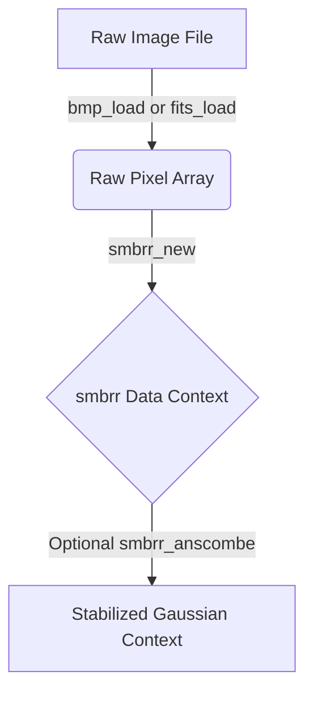
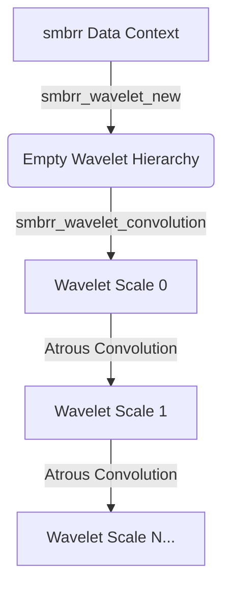
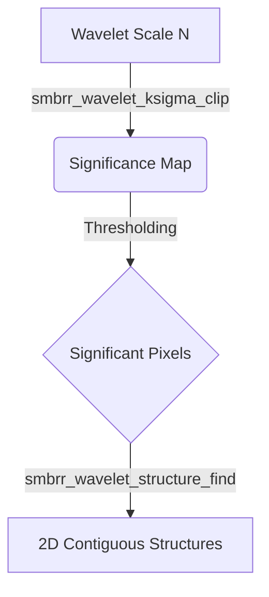
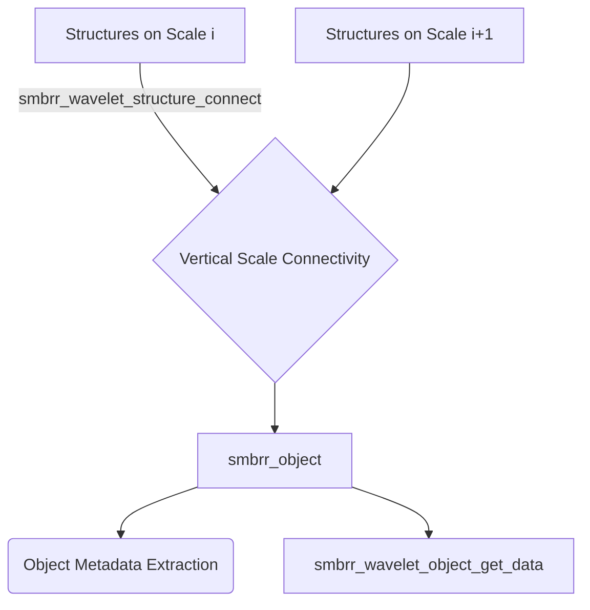
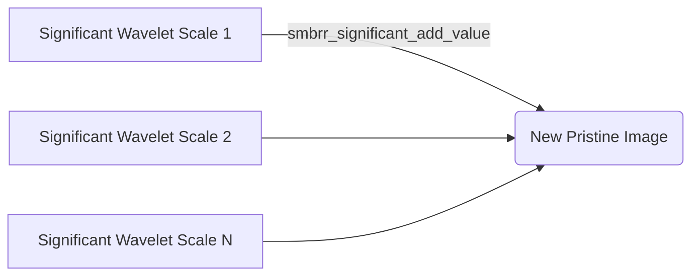

# Libsmbrr Architecture

This document describes the primary data processing pipelines provided by `libsmbrr` (Sombrero). The library specializes in multi-scale wavelet decomposition for astronomical and scientific image processing. The pipeline typically consists of several distinct stages ranging from raw data loading to advanced structure and object detection.

## 1. Initialization and Data Loading

The foundational building block of the `libsmbrr` pipeline is the `smbrr` data context struct. This context abstracts away the underlying bit-depth (8-bit, 16-bit, 32-bit integer or floating-point) and encapsulates the image dimensions, data array strides, SIMD operator pointers, and payload pixel arrays.

* **Data Ingestion**: Raw pixels (e.g., from BMP or FITS files) are parsed and fed into `smbrr_new` to construct the active 1D or 2D numerical context.
* **Pre-Processing (Optional)**: If processing raw CCD data that predominantly exhibits Poisson noise, the `smbrr_anscombe` variance-stabilizing transformation can be applied to convert this noise into approximately Gaussian noise. This prepares the data for standard statistical processing.

## 2. Image Processing (Wavelet Convolution)

At the core of `libsmbrr` is multi-resolution wavelet transformation. Instead of operating solely on raw spatial pixels, operations are primarily performed across localized frequency bands.

* **Wavelet Creation**: A `smbrr_wavelet` context is initialized via `smbrr_wavelet_new`. This context allocates memory for multiple hierarchical decomposition scales (layers), typically up to 9 or `SMBRR_MAX_SCALES`.
* **Convolution Decomposition**: The data is recursively decomposed (smoothed and differenced) into wavelet scales using `smbrr_wavelet_convolution`. The prominent algorithm used is the A-trous ("with holes") algorithm (`SMBRR_CONV_ATROUS`) with either linear or bicubic masks. This operation yields progressive detail coefficients at each scale level.

## 3. Structure Detection

Once the original data array has been decomposed into distinct spatial frequency bands, the pipeline extracts significant, non-noisy features.

* **K-Sigma Clipping**: The `smbrr_wavelet_ksigma_clip` algorithm iteratively applies statistical clipping to exclude background noise across all wavelet scales. This generates a binary "significance map" dynamically tracking statistically prominent pixels relative to their surrounding local background variance.
* **Structure Finding**: Non-zero, contiguous pixels within the significance map at a single scale are spatially grouped together to form independent 2D "structures" (`smbrr_wavelet_structure_find`).

## 4. Object Detection

Structures exist exclusively within independent 2D scales. Real physical elements tend to emit light hierarchically, meaning their energy footprints persist continuously across multiple adjacent frequency scales.

* **Hierarchical Connection**: The `smbrr_wavelet_structure_connect` algorithm iterates through multiple scales, linking localized significant structures horizontally across consecutive wavelet resolution layers.
* **Object Extraction**: A multi-scale connected component conceptually becomes a `smbrr_object`. Key metadata limits are calculated from the aggregated structures, computing spatial domains, signal-to-noise ratios, brightness ADUs, center coordinates, background annulus profiles, and broad classification (e.g., Point vs. Extended Diffuse properties).
* **Data Recovery**: Detailed object pixels stripped from the noisy background can then be individually retrieved via `smbrr_wavelet_object_get_data` for cropped analysis or classification.

## 5. Image Reconstruction

The wavelet detail arrays representing only the significant structures and structures-derived objects can be layered back together to recover a pristine, noise-suppressed view of the original data segment.

### Direct Reconstruction
The specific object components and significance map coefficients on each scale array (usually excluding the raw high-frequency/low-scale layers where noise dominated) are sequentially combined into a new context using `smbrr_significant_add_value`.

### Dedicated Reconstruct Pipeline
The `smbrr_reconstruct` function encapsulates this entire workflow (convolution, iterative clipping thresholds, and scale component reunification) into a single optimized pass, actively regenerating the initial target data array entirely cleansed of non-significant values.
