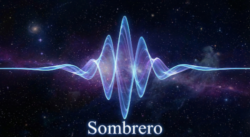
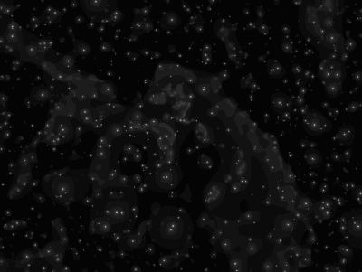

# Sombrero



[](https://github.com/lgirdwood/sombrero/actions/workflows/ci.yml)

Sombrero is a fast wavelet data processing and object detection C library for 1D and 2D data.

Sombrero is named after the "Mexican Hat" shape of the wavelet masks used in data convolution. It is released under the GNU LGPL library. Initially developed for astronomical work, it can also be used with any other data that can benefit from wavelet processing. Some of the algorithms in this library are derived from "Astronomical Image and Data Analysis" by Jean-Luc Starck and Fionn Murtagh.

## Features

- Support for both 1D and 2D data element types.
- Significant element detection with k-sigma clipping to reduce background noise, resulting in better structure and object detection. Various K-sigma clipping levels are supported, including custom user-defined clipping coefficients.
- A'trous Wavelet convolution and deconvolution of data elements. The A'trous "with holes" data convolution is supported with either a linear or bicubic mask.
- Data transformations (e.g., add, subtract, multiply). General operators are supported and can be used for stacking, flats, dark frames, etc.
- Detection of structures and objects within data elements, alongside properties like max element values, brightness, average element values, position, and size. Simple object de-blending is also performed.
- SIMD optimizations for element and wavelet operations using SSE, AVX, AVX2, AVX-512, and FMA on x86 CPUs.
- OpenMP support for parallelism within wavelet operations.

## Building from Source

Sombrero uses CMake as its build system. To build the library and example applications, ensure you have CMake installed, a C compiler supporting C99, and the CFITSIO library (`libcfitsio-dev` or equivalent) for FITS image support. OpenMP and SIMD support (SSE4.2, AVX, AVX2, AVX-512, FMA) will be automatically detected and enabled if supported by your system and compiler.

If you plan to use GPU acceleration, verify that you have an OpenCL implementation installed for your hardware (e.g., `ocl-icd-opencl-dev` or `intel-opencl-icd` along with the standard `opencl-headers`).

```bash
# Clone the repository
git clone https://github.com/lgirdwood/sombrero.git
cd sombrero

# Configure the build directory (out-of-source build)
cmake -B build -S .

# Build using CMake natively
cmake --build build -j$(nproc)
```

### Build Options

By default, CMake will try to enable SIMD optimizations and OpenMP if they are detected. You can explicitly turn them off during CMake configuration:

```bash
cmake -B build -S . -DENABLE_SSE42=OFF -DENABLE_AVX=OFF -DENABLE_AVX2=OFF -DENABLE_AVX512=OFF -DENABLE_FMA=OFF -DENABLE_OPENMP=OFF -DENABLE_OPENCL=OFF
```

### Advanced Configuration (Menuconfig)

The library supports toggling specific CPU architecture optimizations (SSE, AVX, AVX2, AVX-512, OpenMP) and GPU acceleration backends (OpenCL) via a Kconfig-based menu interface. You can launch this interactive configuration console before compiling:

```bash
cmake --build build --target menuconfig
cmake --build build -j$(nproc)
```

### Generating System Packages

To automatically generate distributable system packages (`.deb` for Debian/Ubuntu and `.rpm` for Fedora/RHEL) integrating the library binaries and headers, ensure you have `rpm` and `dpkg-dev` installed locally, then invoke the CPack target:

```bash
cmake --build build --target package
```

## Python Wrapper

Sombrero includes a comprehensive `ctypes` Python wrapper that exposes the entire C API. Once the C library is built, you can install the Python package via `pip`.

You can either install directly from the source directory:

```bash
# Install from the root repository directory
pip install ./python
```

Or you can generate a redistributable Python wheel or source distribution (`sdist`) using the built-in CMake target:

```bash
cmake --build build --target python-package

# The generated wheels and tarballs will be located in build/python_dist/
ls build/python_dist
pip install build/python_dist/sombrero-0.1.0-py3-none-any.whl
```

Usage in Python:

```python
import sombrero as smbrr
# The wrapper automatically loads libsombrero.so and exposes all constants, enums, structs, and functions
```

## Running the Examples and Tests

A few example programs are provided in the `build/examples` directory to demonstrate data processing and object detection algorithms:

- `smbrr-atrous`
- `smbrr-structures`
- `smbrr-objects`
- `smbrr-reconstruct`
- `smbrr-reconstruct-1d`

The examples include simple Bitmap (.bmp) and FITS (.fit, .fits) data support for working with image data.

Example usage for `smbrr-atrous`:

```bash
./examples/smbrr-atrous -i input.bmp -o output.bmp
```

You can view available options for each command using the tool directly:

```bash
./examples/smbrr-atrous -h
```

### Visual Example: Structure Detection

Here is a visual demonstration running `smbrr-structures` to isolate significant features and structures through wavelet convolution k-sigma clipping.

**Original Input Image:**  


**Processed Structures Output:**  


### Example: Object Detection

The `smbrr-objects` example performs structure discovery across wavelet scales and then connects overlapping structures into concrete objects containing aggregated statistics.

**Console Output:**
```text
Found 891 structures at scale 0
Found 703 structures at scale 1
Found 787 structures at scale 2
Found 933 structures at scale 3
Found 841 structures at scale 4
Found 267 structures at scale 5
Found 56 structures at scale 6
Found 12 structures at scale 7
Found 741 objects

object 0 ID 505
 Total ADU 0.473022 Mean 0.473022 Sigma 0.000000 Scale 1 Mag delta 9.389793
 Position 496:150 Area 1
object 1 ID 399
 Total ADU 101.009033 Mean 0.490335 Sigma 13.064160 Scale 3 Mag delta 3.562092
 Position 1635:844 Area 206
object 2 ID 504
 Total ADU 113.812500 Mean 0.492695 Sigma 14.502802 Scale 3 Mag delta 3.238640
 Position 509:150 Area 231
object 3 ID 517
 Total ADU 108.492188 Mean 0.495398 Sigma 13.918968 Scale 3 Mag delta 3.327931
 Position 1162:156 Area 219
object 4 ID 599
 Total ADU 113.406250 Mean 0.495224 Sigma 14.654859 Scale 3 Mag delta 3.236967
 Position 1640:322 Area 229
...
```

### Running Tests

A unit test suite validates execution and mathematical correctness of operations. Tests can be executed via CTest after building:

```bash
cmake --build build --target test
```

Alternatively, a high-level test script runs all binaries and compares output images against verified baselines:
```bash
cd tests
./run_tests.sh
```

## Generating Documentation

If Doxygen is installed, you can generate the library API documentation:

```bash
cmake --build build --target doc
```

The output documentation will be available in HTML format within the `build/html` directory.

## License

This library is free software; you can redistribute it and/or modify it under the terms of the GNU Lesser General Public License as published by the Free Software Foundation; either version 2 of the License, or (at your option) any later version.

Copyright (C) 2026 Liam Girdwood
