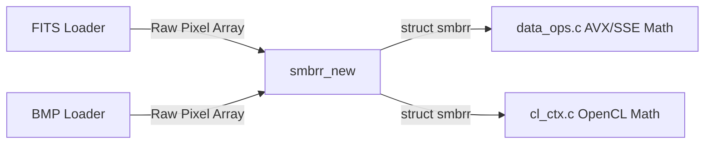
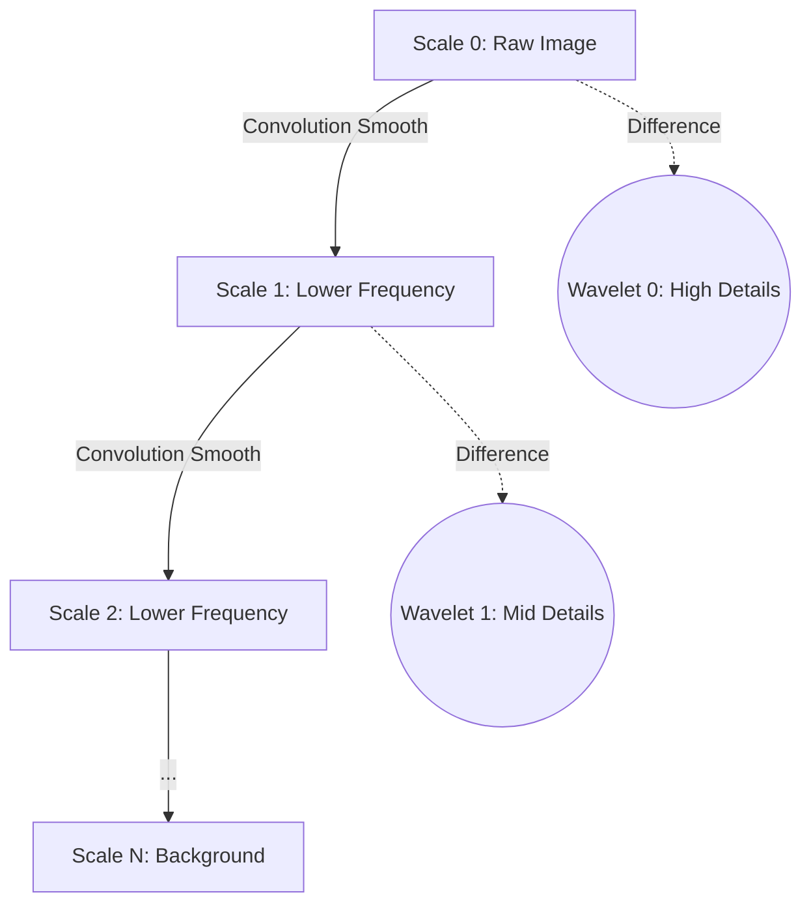
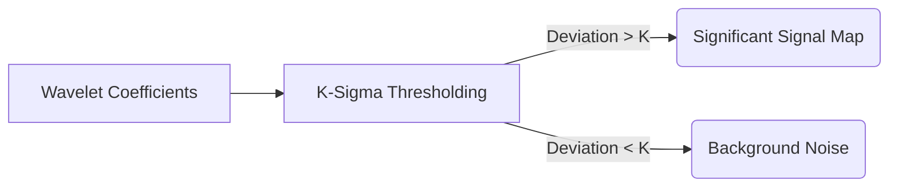
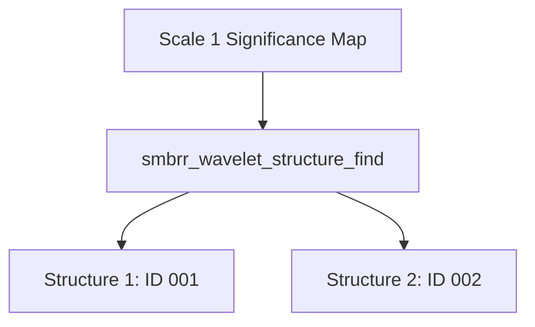
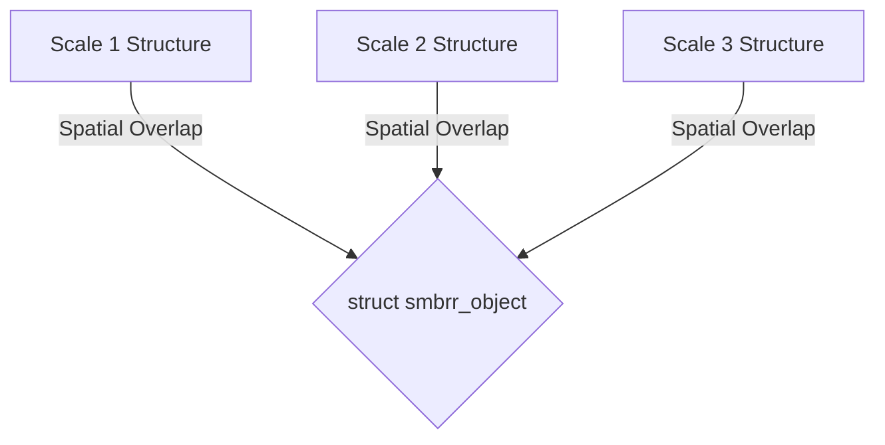
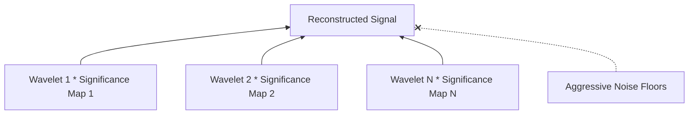

# libsombrero Architecture

`libsombrero` is a high-performance C image processing library specialized for multi-scale astronomical structure detection, object classification, and signal reconstruction. It utilizes SIMD (AVX/SSE) CPU and OpenCL GPU acceleration to parse dense float array matrices.

## 1. Image Processing & Data Structures

### `struct smbrr`
The foundational data context passed throughout the library. It abstracts raw pointer elements:
- `data_ops.c`: Handles physical memory layouts and element-wise array math computations across 2D slices. Hardware targets (e.g., SSE4.2, AVX2, FMA) handle these routines mathematically via compiled vector intrinsics.
- `cpu.c` / `cl_ctx.c`: Determine the available hardware context (CPU SIMD extensions vs OpenCL GPU mapping) used to distribute these array operations dynamically.

### Core Lifecycle
1. Arrays are loaded from their application wrapper formats (e.g., `fits.c` / `bmp.c`).
2. Mapped into standard `smbrr` configurations via `smbrr_new()`.
3. Pushed into processing loops.

## 2. Wavelet Transforms

The logic of identifying complex astronomical objects relies heavily on splitting a noisy flat image into separated resolution "scales" (frequencies).

### `wavelet.c` / `convolution.c`
1. **`smbrr_wavelet_new()`**: Initializes an organizational hierarchy (`struct smbrr_wavelet`) splitting the base image layer (`Scale 0`) up to `N` layers deep (usually 9 scales).
2. **`smbrr_wavelet_convolution()`**: Executes repetitive smoothing convolutions across scales. The difference (delta) between two linearly smoothed scales yields the "wavelet" coefficients: high frequencies (sharp details) dominate early scales, while low frequencies (broad nebulae) sit deeper down.
3. **`smbrr_wavelet_get_wavelet()`**: Extracts these isolated detail levels.

## 3. Structure Detection & Noise Modeling

Before objects belong to stars or galaxies, they start as abstract mathematical "structures" standing apart from local background noise levels via statistical deviation.

### `noise.c`
1. **`smbrr_wavelet_ksigma_clip()`**: Analyzes each separated scaling layer and statistically computes its median background distribution.
2. Pixels deviating by $K \times \sigma$ standard deviations are logically flagged. 
3. **Significance Map**: `smbrr_wavelet_get_significant()` returns this precise Boolean array isolating real signal (true structures) from ambient noise.

### `object.c` (Structural Connect)
1. **`smbrr_wavelet_structure_find()`**: Executes Connected Component Analysis (CCA) across adjacent positive significant pixels on a given scale, grouping contiguous shapes into generic ID structural clumps.

## 4. Object Detection

Structures are independent isolated features isolated on their singular scale. However, real astronomical objects project power across *multiple* frequencies simultaneously (e.g., a bright star will have a sharp primary scale 1 peak, and broader glowing halos bleeding into scales 2 and 3).

### `object.c` (Object Connect)
1. **`smbrr_wavelet_structure_connect()`**: Scans overlapping structural geometries hierarchically between successive scale layers.
2. Contiguous regions of matching structural boundaries are aggregated logically representing a physical `struct smbrr_object`.
3. Object boundaries and parameters (SNR limits, limits bounds) are finalized across multi-scale depths. Extraction bounding boxes are assigned dynamically.

## 5. Image Reconstruction

Once target structures and generalized significant pixels have been isolated from algorithmic noise, they can be re-compiled logically to produce a mathematically sterile view of the sky without background variance.

### `reconstruct.c`
1. **`smbrr_wavelet_deconvolution_object()` / `smbrr_wavelet_significant_add()`**: Inverse process to the initial wavelet transform. Instead of expanding the image, the engine stacks specific isolated detail scales back upwards iteratively. 
2. Specifically masking by the binary significance maps guarantees that ambient background signals identified in the initial convolution are aggressively culled, whereas core components are mapped back structurally intact (`smbrr_reconstruct`). 

